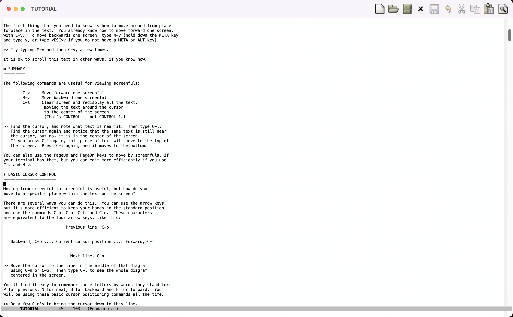
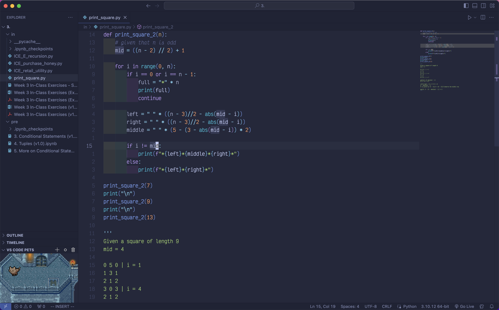
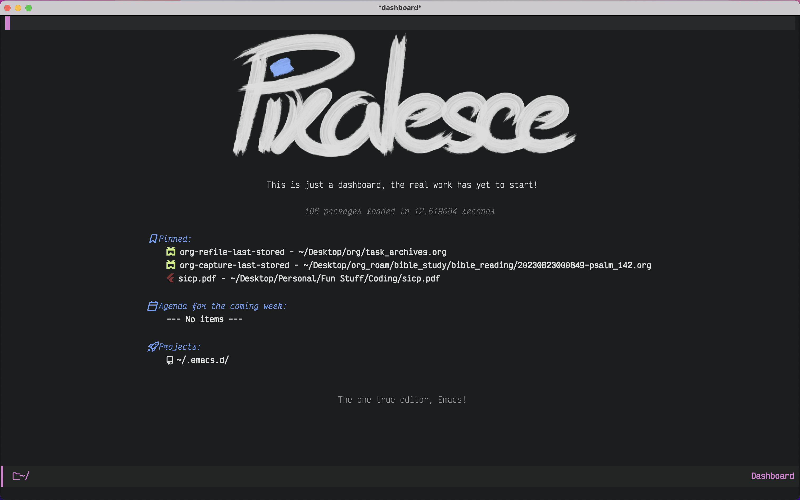
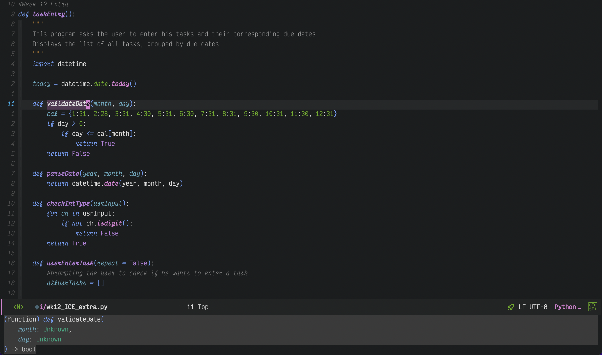
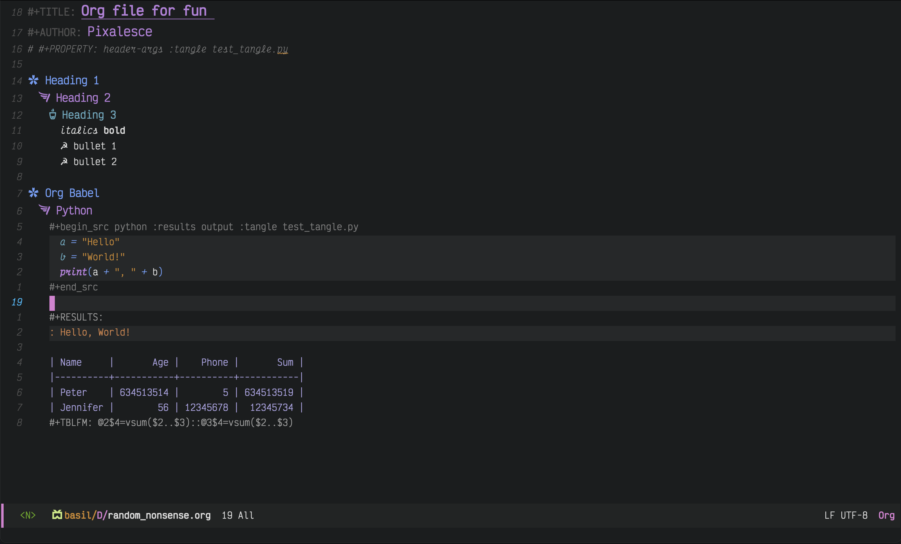
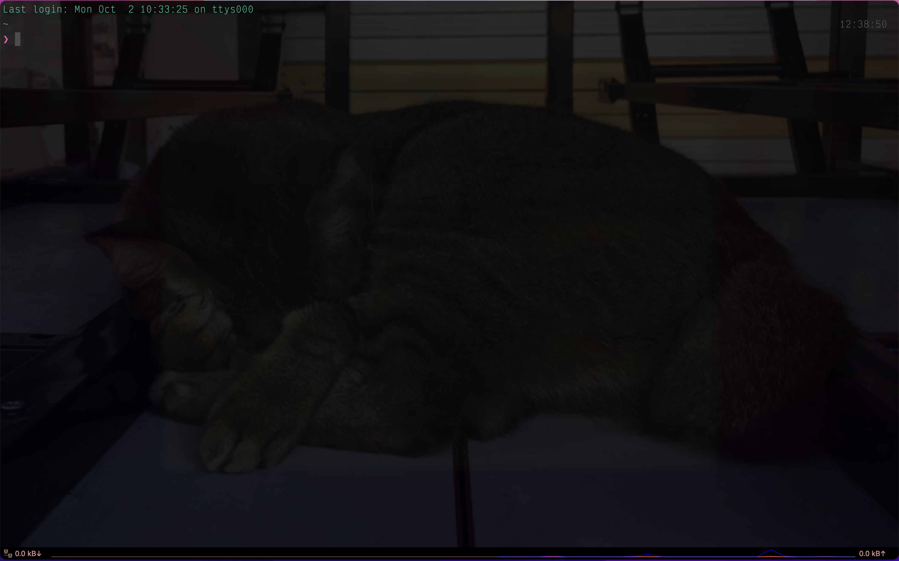
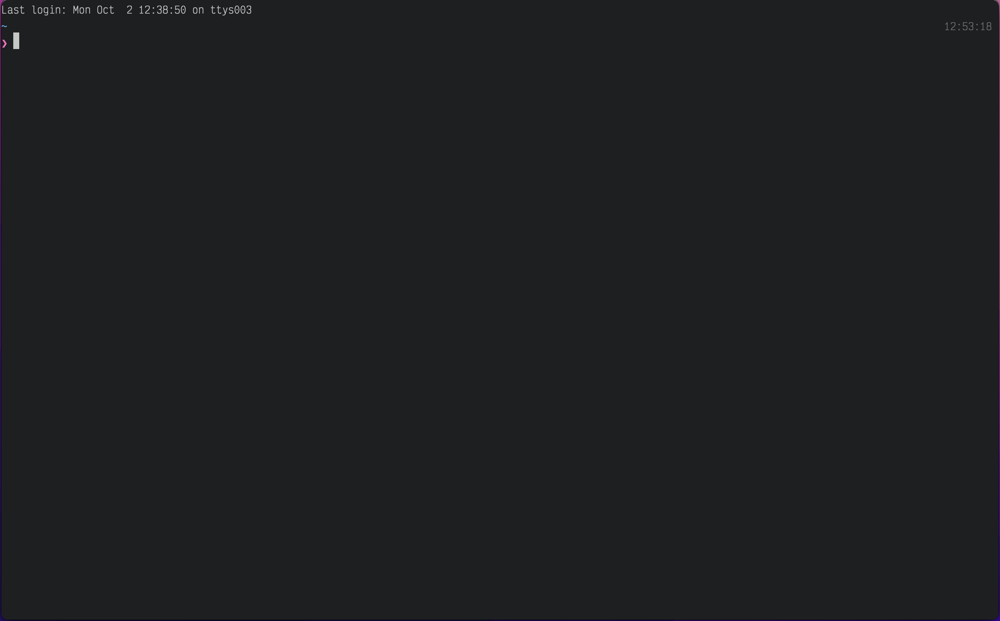
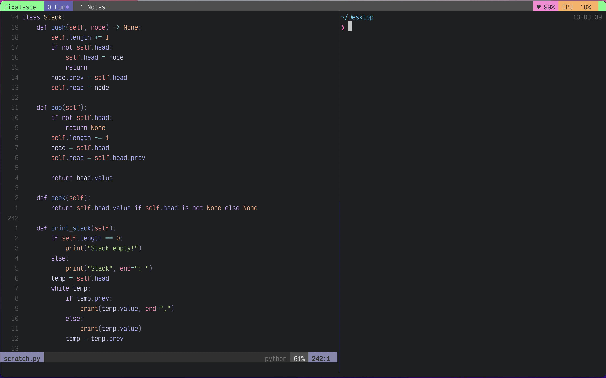

# My Journey
## Genesis
My seeds of my foray into productivity were planted in the my early university days, when my good friend, [McNaBry](https://github.com/McNaBry) introduced to me to [Structure and Interpretation of Computer Programs](https://mitpress.mit.edu/9780262510875/structure-and-interpretation-of-computer-programs/), by Harold Abelson and Gerald Jay Sussman with Julie Sussman. In their introduction to Unofficial Texinfo Format, there lay a curious statement
>You are probably reading it in an Info hypertext browser, such as the Info mode of Emacs.

This got me wondering, "[Emacs](https://www.gnu.org/software/emacs/)? What is that?" As a relatively fresh face in the realm of programming, I excitedly downloaded the editor and got playing with it. It had a fabulous tutorial, teaching about the basic movements in Emacs, using windows and buffers, and much more. While moving around with `<C-f>` and `<C-b>` felt reasonable, more advanced features that utilise the `<Meta>` key felt incredibly uncomfortable, having to twist my hand to get my pinky where it needed to go. However, I was excited. I had something new, something "that the pros were using". If this is what the authors of a book used, it can't be anything bad right? A brief conversation with McNaBry also revealed that his university was teaching students [Vim](https://www.vim.org/), another editor with roots from the 80s. Deciding to take the opposing route from him so that we'll have a diverse perspective, I put my head down and continued with the Emacs built-in tutorial.

That was the case until a few days later when I decided to do a little more research into this cool new application I was using. Not only could I use Emacs from either the command line or the GUI, I was also greeted by the various Emacs distros from [Prelude](https://github.com/bbatsov/prelude) and [Graphene](https://github.com/rdallasgray/graphene), to [Doom Emacs](https://github.com/doomemacs/doomemacs) and [Spacemacs](https://www.spacemacs.org/). The powers of vast extensibility and customisability that it gifted its users enticed me. I wanted all that and more. A beautiful interface, a personalised custom dashboard with my commonly used files a click a way, and even the ability to browse the web and respond to emails from within Emacs. Wouldn't it be great to have almost all the functionality I would need in a single application on my computer? Yet, this was also a daunting time as I stared at everything in front of me. Classes, clubs and new communities. Do I really have the capacity to learn the basics of python while learning a new editor? Which distribution of Emacs do I choose? There were too many questions to be answered, and I chose the most rational decision at that point in time -- use [VS Code](https://code.visualstudio.com/).

*Vanilla Emacs Tutorial*
## Visual Studio
At this point, I was about 3 weeks into my classes, and have slowly gotten comfortable in VS Code. It is an incredible piece of software, fully featured with a host of plugins that extends features of the application to almost anything that I needed or wanted. While learning how to do conditionals, the thought of Emacs was always at the back of my mind, wondering if these features that I have gotten so comfortable with in VS Code will be possible in it. Especially after watching [Fireship](https://github.com/fireship-io)'s video on [25 VS Code Productivity Tips and Speed Hacks](https://www.youtube.com/watch?v=ifTF3ags0XI), I was convinced that this is the best text editor for every programmer. Multi cursor allowed for quick and edits over multiple lines, a command palette that allowed me to manage functionality of VS Code, and an integrated terminal that allowed me to run my python code from within the application itself. Is this not what I was looking for? VS Code indeed fit the bill an editor that could perform the functionality of multiple applications in one, while providing a pleasing aesthetic.

Yet, this line from Fireship's video stuck with me. 
>You don't have to go crazy and learn something like Vim or Emacs

Are Vim and Emacs really only for *crazy* people?

*My VS Code layout*
## Emacs
### Doom
It took a while, but the perfect storm of time, freedom, and the desire to explore my developer environment eventually came. Summer holidays arrived. Like a moth to a flame, I dived head first into the deep end, watching video after video about Emacs, such as [Distrotube](https://www.youtube.com/@DistroTube)'s [Doom Emacs For Noobs](https://www.youtube.com/watch?v=iab2z21cRqA) and [The Absolute Beginner's Guide to Emacs](https://www.youtube.com/watch?v=48JlgiBpw_I) by [System Crafters](https://www.youtube.com/@SystemCrafters). I used Doom Emacs for about a week, enamoured by all its built-in features and simplicity in setting up. It was a sandbox of features that could be toggled on and off simply but removing comments on a line of code in the configuration file. It provided [LSP](https://emacs-lsp.github.io/lsp-mode/) support for code completion and diagnostics (finding out the feature that was providing me sweet sweet code completions in VS Code was an amazing experience), [which-key](https://github.com/justbur/emacs-which-key) for guidance on keyboard shortcuts and functionalities, and of course, Vim motions.

The first few days of using Doom was difficult, having to scan through the multitude of keybindings that came built-in to figure out the best ones to use, but as I got more familiar, working in Doom gradually became enjoyable. Yet, I never could escape the feeling that I was a stranger in someone else's home, exploring and learning the "Doom way" of using Emacs. If I were to use Emacs on a long term basis, I wanted it to be catered specifically to me. I wanted ownership of my environment.

I needed to configure Emacs for myself.
### [Pixa Emacs](https://github.com/Pixalesce/Pixa_Emacs)
Following SystemCrafters's [Emacs from Scratch](https://systemcrafters.net/emacs-from-scratch/), I gradually built up my configuration, learning the invaluable skill of reading documentation, and building my patience as I struggled with [Emacs Lisp](https://www.emacswiki.org/emacs/LearnEmacsLisp), a dialect of the [Lisp](https://lisp-lang.org/) programming language, and my lack of experience in configuring an editor. It look me the better part of two weeks, but after trawling through the depths of [Reddit](https://www.reddit.com/r/emacs/) and [Emacs Stack Exchange](https://emacs.stackexchange.com/), Pixa Emacs finally reached infancy. I had all the basics of a text editor, from syntax highlighting to LSP, and even an incredibly useful [Git](https://git-scm.com/) interface via [Magit](https://github.com/magit/magit). I was incredibly pleased.

*Emacs dashboard*

*Editing files in Emacs*

As any Emacs user, I then spent the rest of the month exploring [Org Mode](https://orgmode.org/), a note taking system within Emacs itself. Together with [Org-babel](https://orgmode.org/worg/org-contrib/babel/), I could write my notes for school with executable code blocks, a functionality that not even [Notion](https://www.notion.so/) provides. The fact that I could write code my Org notes and have them extracted out into another code file via [Org-babel-tangle](https://orgmode.org/manual/Extracting-Source-Code.html) absolutely blew me away. I thought that I had the epitome of text editors under my fingertips, and anything was possible if I put in the effort to learn how to extend Emacs, and even had an entire roadmap written out for the features I would like to include in my Emacs configuration such as an [Org-Roam](https://www.orgroam.com/) [Zettelkasten](https://zettelkasten.de/) and an email client.

*Emacs org mode*
>With Emacs, the sky is the limit for what you can do.

At this point, I have used Emacs for over 2 months, and have gotten very comfortable with it. As I headed back to school, I was convinced that this tool at my fingertips would supercharge my learning experience and make school that much more fun. It was not to be. During my first web development class, I ran into a huge wall. [HTML](https://developer.mozilla.org/en-US/docs/Learn/Getting_started_with_the_web/HTML_basics) and [CSS](https://developer.mozilla.org/en-US/docs/Web/CSS) completion, including additional features such as highlighting of CSS colours, were not properly set up!

After some preliminary research, I realised that I didn't have a quick and easy way to do it with my current LSP configuration, or [Company mode](https://www.emacswiki.org/emacs/CompanyMode) in Emacs. Not having the time at this juncture to pour hours into working out a fix for this, I had to find another option, and I didn't want to go back to VS Code if I didn't need to. Not that VS Code isn't good, but there was no way for me to go back to it after experiencing the joy and freedom of customising my very own editor.
>VS Code is powerful, but unfriendly to configure
## Vim ([Neovim](https://neovim.io/))
Vim. Let's switch to Vim.

Even while configuring Emacs, Vim was somehow always in the periphery, as proponents of these two editors make the case of each being the best editor ever. Considering that I was already using Vim motions in Emacs, I decided that it would be worth a shot and a relatively low barrier to give Vim a go. After some brief reading and research, I decided to download Neovim as it is written in [Lua](https://www.lua.org/), a general purpose embeddable scripting language, and could pay dividends in future over something like [vimscript](https://www.vim.org/vim90.php), which is specific to Vim. Furthermore, Neovim is much easier to configure, with a vibrant plugin ecosystem driven by the community and various plugin managers designed to ease people just like myself into configuring their editors.

After browsing a few distributions such as [kickstart](https://github.com/nvim-lua/kickstart.nvim) and [LunarVim](https://www.lunarvim.org/), I decided to take a weekend and set up Neovim from the ground up. Fortunately for me, [ThePrimeagen](https://www.youtube.com/@ThePrimeagen) had the perfect video waiting -- [0 to LSP: Neovim RC From Scratch](https://www.youtube.com/watch?v=w7i4amO_zaE&pp=ygUIMCB0byBsc3A%3D). (His videos are also wonderful. Have been following him ever since.) The move to Neovim has brought me incredible joy. I'm not sure if it is simply a matter of perception, but using Vim motions inside Neovim feels so much smoother than inside Emacs or as emulated in VS Code. The built-in LSP client was also relatively simple to set up and use, thanks to [LSP Zero](https://github.com/VonHeikemen/lsp-zero.nvim) by [VonHeikemen](https://github.com/VonHeikemen) and [Mason](https://github.com/williamboman/mason.nvim) by [williamboman](https://github.com/williamboman).

As my usage of Neovim matured, I increasingly began to appreciate the productivity boost that it offers, and it has slowly become something that I am paying more attention to while planning and optimising my workflow. Gone are file trees, replaced by the fuzzy finding of [telescope](https://github.com/nvim-telescope/telescope-file-browser.nvim), allowing me to hop around my files at will. This has even spilled beyond the scope of Neovim into the way I navigate my file system in the terminal, using [fzf](https://github.com/junegunn/fzf) to fuzzy find my way to desired files or directories.
>jumping around files using telescope increases familiarity with a code base!
## [iTerm2](https://iterm2.com/)
Along with my movement into the terminal, I craved an enhanced experience there too. The default Macbook terminal is functional, but doesn't provide the breadth of customisability that I have grown so accustomed to. Drawing insight from [How To Make Your Boring Mac Terminal So Much Better](https://www.youtube.com/watch?v=CF1tMjvHDRA) by [Josean Martinez](https://www.youtube.com/@joseanmartinez), I installed iTerm2 and began tinkering. I customised the prompt, keybindings for managing multiple terminal instances, and shortcuts for various actions. It was glorious.

*iTerm2 look and feel*
## [Alacritty](https://alacritty.org/)
If there was one thing that iTerm lacked, it was the fact that it is a Mac-only application. As nice as it was to use, I kept wondering about what a similar set up would look like on Linux. My exploration for a preferred terminal emulator has begun. My search eventually boiled down to these two options -- [Kitty](https://github.com/kovidgoyal/kitty), and Alacritty. Both are highly configurable, runs on MacOS and Linux, and are GPU accelerated. (Kitty even has a graphics protocol allowing users to view images right from the terminal!) Yet, it was this feature richness that drew me over to Alacritty. It was sleek, minimal, and had only what I needed. Configuring Alacritty was also much simpler, as its fewer options meant a smaller config file.

*Alacritty look and feel*
## Terminal Multiplexing
Unfortunately for me, the switch over to Alacritty meant that I no longer had built-in functionality of managing multiple terminal instances, resulting in me having to either (1) close Neovim, run my code, remember the any warnings or errors I'm getting, before reopening Neovim to make the necessary edits, or (2) open another instance of Alacritty as a separate window and navigate between the two instances with my mouse. Neither of these methods were intuitive, and left a sour taste as I had to take my hands off the keyboard just to perform an action as simple as moving to the neighbouring window, an action that I have gotten to comfortable with within Neovim via `<C-w>{hjkl}`.

Just as I thought that I had hit a dead end, I was introduced to [tmux](https://github.com/tmux/tmux) in [My Developer Workflow - How I use i3, tmux, and vim](https://www.youtube.com/watch?v=bdumjiHabhQ), another video by ThePrimeagen. My eyes were opened. Almost immediately, I downloaded tmux and exploring its features and quirks. Oh, how good if felt to be able to have a separate window with a new terminal instance that I could navigate to with just the keyboard! Not only that, having persistent terminal sessions was something I didn't know I needed, but is something I definitely cannot live without now.

*tmux look and feel*
## Window Manager
The beauty of the productivity mindset is that it permeates into every aspect of your workflow. At the point in time when I moved to use Alacritty as my terminal emulator, I was using [Rectangle](https://rectangleapp.com/) to power shortcuts for managing the size and position of windows on my screen, and was pretty much content with it. With a few keystrokes, I could resize my screen to half, or even a third or two thirds of my screen, and position it at will. However, it had a core functionality missing. I could not easily switch between windows by manner of keystrokes. It was an action that had become deeply ingrained in me by this point in time through my usage of Neovim and tmux, and it was sorely missed in my day to day use of my computer. I needed a gem to brighten up this space of my workflow.

[Amethyst](https://ianyh.com/amethyst/), a tiling window manager was just what I needed. Not only is it free, it has the whole slew of features that I would expect from such an application. While it did take a bit of time to get used to, it has completely revolutionised my productivity on my computer as I not longer reach for the mouse to change windows, and instead have dedicated workspaces for various tasks which I can switch to with minimal keystrokes.
## Closing Thoughts
My journey over the past year has been a whirl and I have learnt an incredible amount about using my terminal to perform tasks and actions, while personalising CLI tools around a developer centric workflow based on the philosophy of simplicity and speed. An increased familiarity and comfort from within a terminal has also boosted my confidence as a developer, as I now feel closer to the machine that I am working with.  

Now, I am reading [Practical Vim](https://pragprog.com/titles/dnvim2/practical-vim-second-edition/) by Drew Neil, and intend to check out his other book, [Modern Vim](https://pragprog.com/titles/modvim/modern-vim/) afterward to gain mastery of Neovim as I hope to give back to the community at some point in the future.

*This is not a sponsored article. This post is a chronicle of my own journey in developing my workflow. Any representations of persons or applications stated are based on my own personal opinion.*
