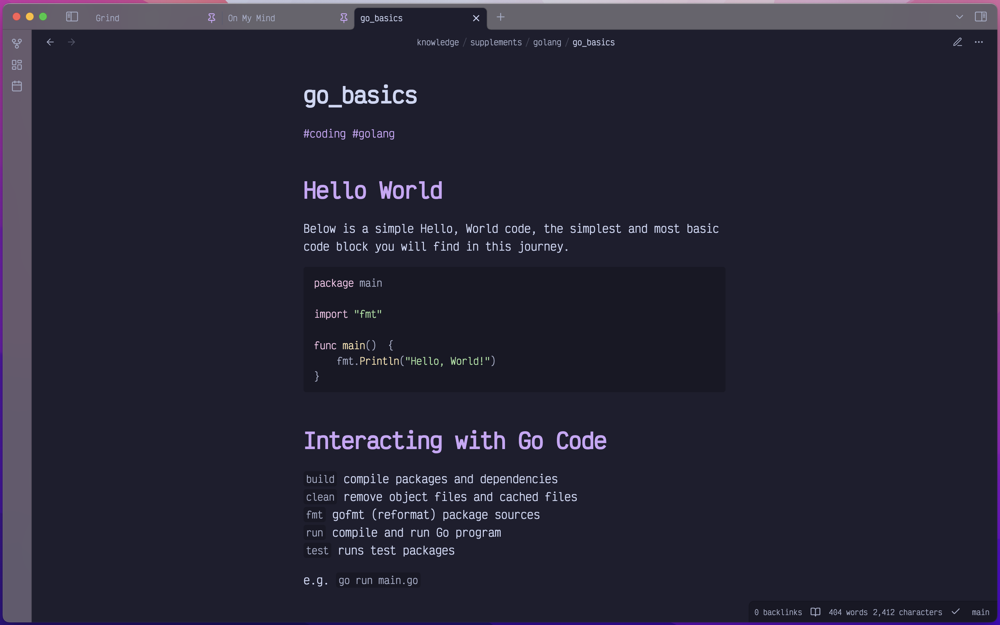
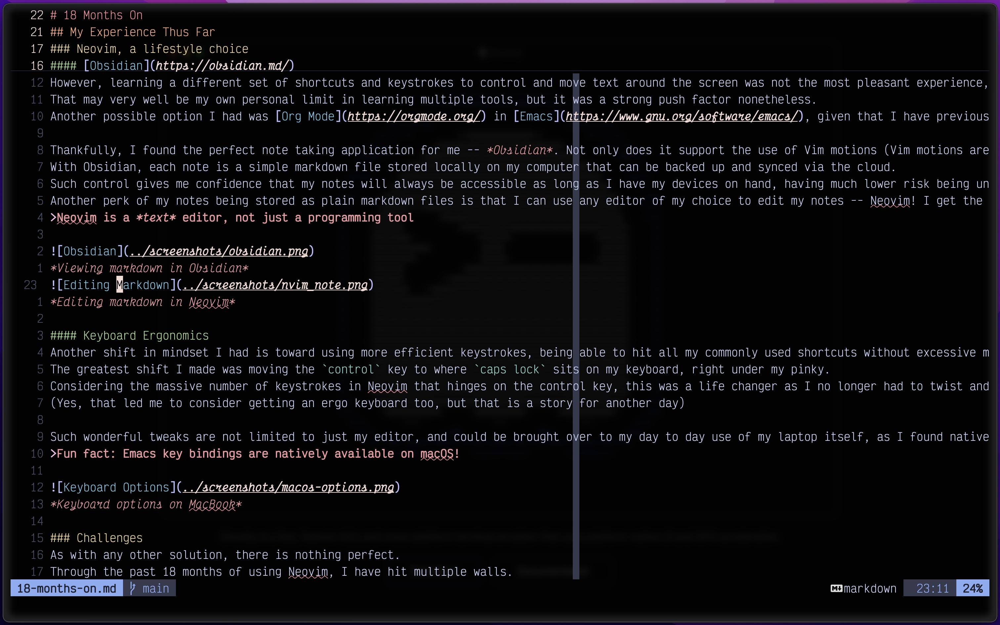
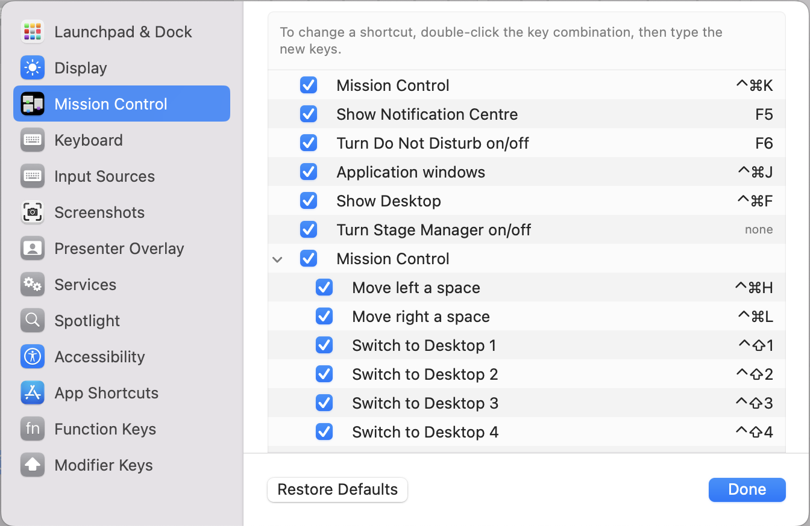
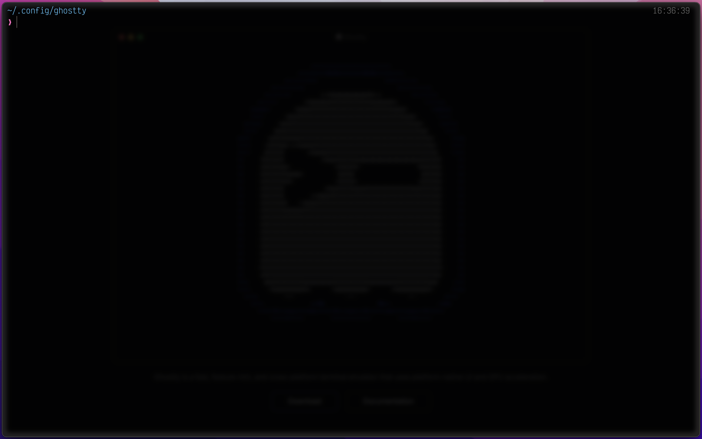
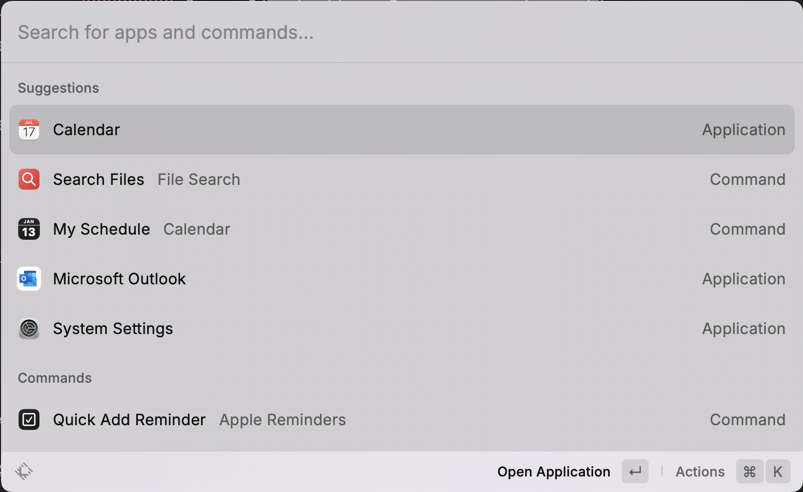

# 18 Months On
## My Experience Thus Far
In a whirlwind of many activities, it has been a year and a half since I began my journey and adoption of Neovim as my daily driver.
As 2025 begins, I wanted to take some time and reflect on the impact that this simple tool has had on my workflows and some challenges that I have faced in my usage of it.

### Neovim, a lifestyle choice
#### [Obsidian](https://obsidian.md/)
For better or worse, Vim motions has since been the default way that I think and interact with my computer, influencing both setup and application choices.
Picking out a note taking app, for example, used to be a simple endeavour for me, where I would go with the app that provided me with the greatest wealth of features and a nice interface.
[Notion](https://www.notion.so/) fit the bill perfectly for me at one point in time, boasting an extremely pleasant UI with an (in my opinion) unmatched ability to collaborate and share notes with other users.
However, learning a different set of shortcuts and keystrokes to control and move text around the screen was not the most pleasant experience, as I constantly find myself hitting the wrong keys by instinct even after using the application for a few months.
That may very well be my own personal limit in learning multiple tools, but it was a strong push factor nonetheless.
Another possible option I had was [Org Mode](https://orgmode.org/) in [Emacs](https://www.gnu.org/software/emacs/), given that I have previously set up a pleasant working system, but I figured that it would be impractical for me to maintain another editor with a differing philosophy just to fulfil the need of taking notes and managing a to-do list.

Thankfully, I found the perfect note taking application for me -- *Obsidian*. Not only does it support the use of Vim motions (Vim motions are keyboard-driven instructions to move the cursor through text), but it also allows me to have full ownership over all the notes that I take.
With Obsidian, each note is a simple markdown file stored locally on my computer that can be backed up and synced via the cloud.
Such control gives me confidence that my notes will always be accessible as long as I have my devices on hand, having much lower risk being unable to access my notes when lacking connectivity or a potential data failure wiping my information.
Another perk of my notes being stored as plain markdown files is that I can use any editor of my choice to edit my notes -- Neovim! I get the best of all worlds, using a comfortable and customisable editor, while having the enhanced markdown rendering features that Obsidian provides, including exporting my notes to pdf for sharing! As an aside, Neovim with [Treesitter](https://github.com/nvim-treesitter/nvim-treesitter) has wonderful syntax highlighting for markdown as well!
>Neovim is a *text* editor, not just a programming tool

*Viewing markdown in Obsidian*

*Editing markdown in Neovim*

#### Keyboard Ergonomics
Another shift in mindset I had is toward using more efficient keystrokes, being able to hit all my commonly used shortcuts without excessive movements of my hands.
The greatest shift I made was moving the `control` key to where `caps lock` sits on my keyboard, right under my pinky.
Considering the massive number of keystrokes in Neovim that hinges on the control key, this was a life changer as I no longer had to twist and shift my hand to access such a commonly used key.
(Yes, that led me to consider getting an ergo keyboard too, but that is a story for another day)

Such wonderful tweaks are not limited to just my editor, and could be brought over to my day to day use of my laptop itself, as I found native options within the Mac settings to rebind hotkeys for common commands, opening me to a whole new paradigm of navigating the desktop spaces in my laptop! It is really incredible how much can be done without my hands leaving the home row.
>Fun fact: Emacs key bindings are natively available on macOS!

*Keyboard options on MacBook*

### Challenges
As with any other solution, there is nothing perfect.
Through the past 18 months of using Neovim, I have hit multiple walls.

#### Java
The first roadblock I hit in this journey was in my Java course.
After some initial tinkering, I found a working [jdtls](https://github.com/eclipse-jdtls/eclipse.jdt.ls) to be a working LSP, but felt that it was somewhat slow and finicky to configure.
Well, it is not impossible, but it entailed a greater degree of complexity that I deemed worthwhile to configure my editor for a programming language that I might frequently use in the longer term.
Furthermore, [JetBrains](https://www.jetbrains.com/) and did an incredible job with [IntelliJ](https://www.jetbrains.com/idea/), providing a superb developer experience out of the box, with many additional tooling to support Java development, making it easier for me to navigate the codebase and understand its methods.
Cherry on top? The [IdeaVim](https://plugins.jetbrains.com/plugin/164-ideavim) plugin supports for most Vim motions and is really smooth to use! Not a sleight against Neovim, but I got everything I wanted with IntelliJ and more.
(Neovim gotta take a back seat here)

#### Unity
Similar to my experience in writing Java, developing a game in [Unity](https://unity.com/) during my internship shifted me away from a text editor, to more a traditional IDE -- JetBrains [Rider](https://www.jetbrains.com/rider/).
Configuring Neovim to work with the complex C# ecosystem proved to be futile, as I tried tirelessly for various solutions that could get me to a reasonable place for development, but not only found that Unity's specific way of handling the file directory and then getting proper recognition and navigation of such a file structure in Neovim was difficult, but that the LSP for C# to interface with such a file structure was equally complicated.
Once again, while not absolutely impossible to set up, there was little value to be gained in forcing the issue.

#### Collaboration
An aspect of diving into Neovim that I failed to anticipate in the beginning was an increase in difficulty when collaborating with others, especially when it requires my using of a teammate's machine, or a teammate using my machine.
Having changed not just key bindings on my laptop, but also keystrokes for some shortcuts, using another person's laptop takes greater cognitive awareness to recall the standard keys, all while making a many mistakes.
(I use the Emacs binding `C-h` to delete the most recent character)
The inverse is true when someone has to use my laptop, though that can be mitigated to a certain extent by having VS Code available.

Thankfully, such events are not common place, and has not adversely affected my ability to contribute to a team project.

## The 2025 Neovim Configuration
So, after 18 months and many minor tweaks to my editor settings, I did the most natural thing, and rewrote my configuration for Neovim.
This time, I searched up Lua tutorials to gain a better grasp and understanding of the interface that I am using to make changes to the behaviour of my editor, and leaned more on internal and online documentation than gasping for videos and hoping someone had made a Reddit post on the specific problem that I was encountering or trying to solve.
In this process, I learnt a great deal more about this amazing editor, including the fact that I can have multiple active configurations on my computer and access the correct one on start using `NVIM_APPNAME`.
Knowing that I can either clone my current config to test potential changes or open a clean config to test another idea is so alluring, but I don't think it is something I'll fully utilise in the near future.

There was also this silly error that was rather annoying to trace, to which I found that I have not been exporting `$PATH` correctly in my `.zshenv` file that hasn't been touched for the longest time.
Thought it was quite interesting that this mistake didn't affect my previous config, but I'm glad that I found out and learnt to properly append `$PATH` when adding in a new path..

My current study and area of focus for Neovim usage? [Quickfix](https://neovim.io/doc/user/quickfix.html)!

## Embracing [Ghostty](https://ghostty.org/)
Since using Neovim, the terminal emulator has been an area I've placed greater emphasis on.
While I dare not say that I live in the terminal, the fact that it directly affects my experience in both programming and writing, it is vital that I get it right.
Though my experience with Kitty and Alacritty are not bad by any means, Ghostty positioning itself as the best terminal emulator is really enticing and enough for me to give it a shot.
For now, the experience has been really smooth, requiring minimal configuration required to get it to look and behave in the way that I want it to.

*Ghostty look and feel*

## [Raycast](https://www.raycast.com/)
Thinking back, I find it difficult to understand how I have taken this long to download and start using Raycast.
It has been such a game changer for the way I use my MacBook and certain workflows, giving me shortcuts to access and open applications, open saved links to commonly used sites, and manage my list of daily reminders.
Truly it is more than just a drop in substitute for Spotlight!

*Raycast look and feel*

## Closing Thoughts
Barring a major event that calls for a change in the way I use my laptop, I will probably never stop using Neovim.
However, this should be my last article on this subject, as I seek to move on to other topics of interest that I want to dive in deeper and become an expert on.
Till then, vim on!

*This is not a sponsored article. This post is a chronicle of my own journey in developing my workflow. Any representations of persons or applications stated are based on my own personal opinion.*
